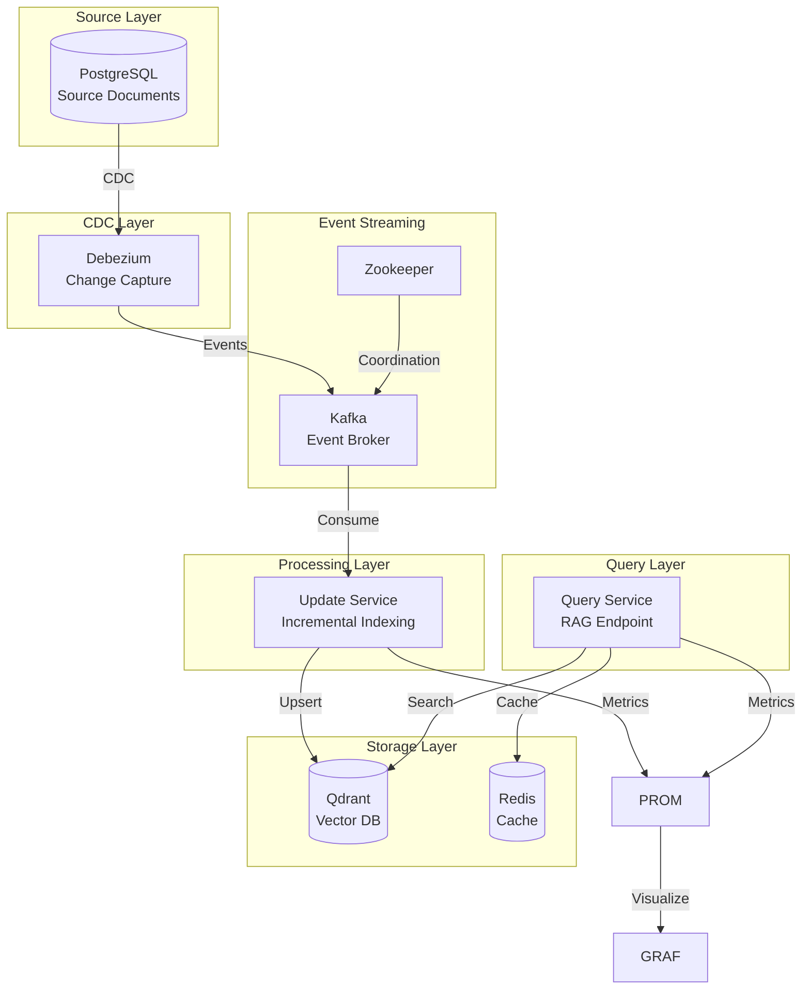
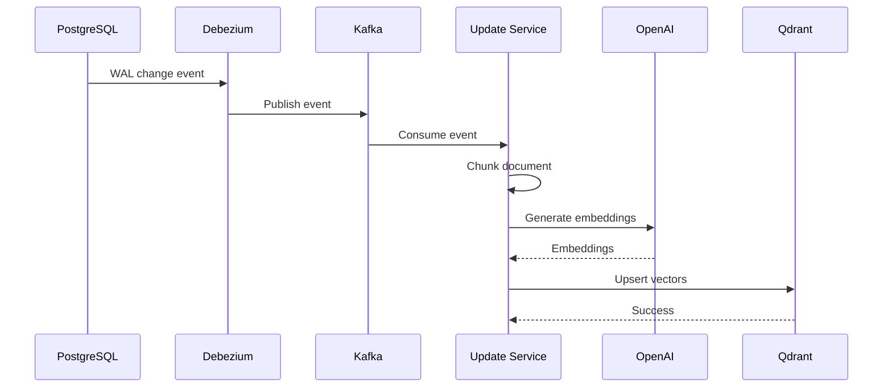
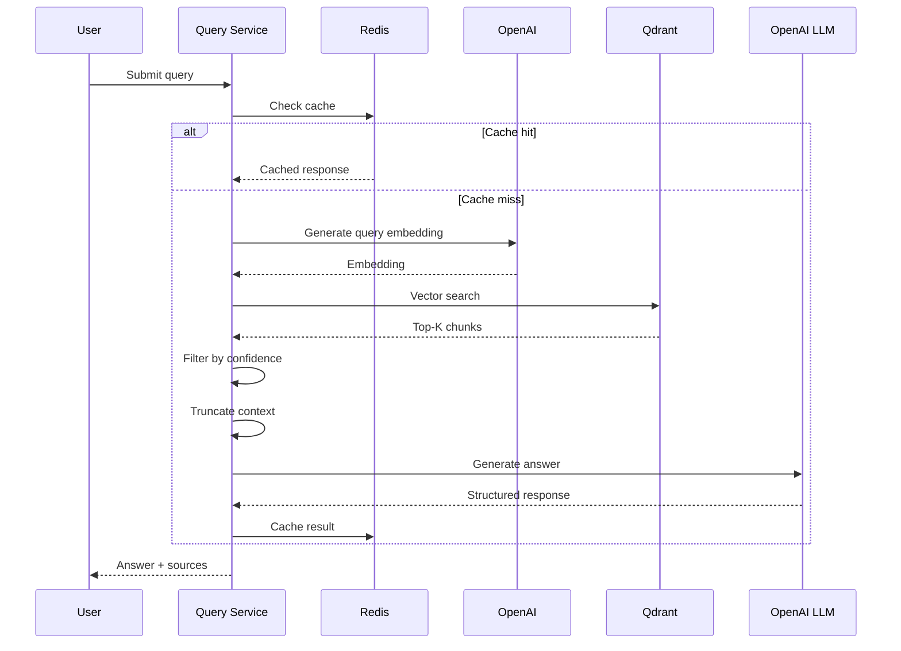

# How It Works: Architecture & Data Flow

This guide explains how the Real-Time RAG system processes document updates and queries in real-time without full reindexing.

## System Architecture

The system uses a layered architecture with Change Data Capture (CDC) to stream document changes from PostgreSQL to Qdrant:

### Key Components

- **PostgreSQL**: Source of truth for documents. Configured with `wal_level = logical` to enable CDC.
- **Debezium**: Captures INSERT/UPDATE/DELETE events from PostgreSQL WAL (Write-Ahead Log).
- **Kafka**: Event streaming broker that distributes change events to consumers.
- **Update Service**: Processes events, chunks documents, generates embeddings, and updates Qdrant.
- **Query Service**: Handles RAG queries, searches vectors, and generates LLM responses.
- **Qdrant**: Vector database storing document chunks as embeddings.
- **Redis**: Caches query results and embeddings to reduce latency.

## Update Flow: How Documents Are Updated in Real-Time

When a document changes in PostgreSQL, here's what happens:

### Step-by-Step Process

1. **Document Change**: A document is updated in PostgreSQL (INSERT, UPDATE, or DELETE).
2. **CDC Capture**: Debezium reads the change from PostgreSQL's WAL and creates a change event.
3. **Event Streaming**: The event is published to a Kafka topic (`documents.public.documents`).
4. **Event Consumption**: The Update Service consumes the event from Kafka.
5. **Document Chunking**: The document is split into chunks using deterministic UUIDs (same document = same chunk IDs).
6. **Embedding Generation**: Only changed chunks are sent to OpenAI to generate embeddings.
7. **Vector Update**: New embeddings are upserted to Qdrant with the document version.
8. **Version Tracking**: Old chunks are filtered out by version, ensuring queries only see the latest data.

### Why This Works

- **Incremental Processing**: Only changed chunks are re-embedded, not the entire document.
- **Deterministic Chunking**: Same document content produces the same chunk IDs, enabling efficient updates.
- **Version Tracking**: Document versions prevent race conditions and stale data.
- **Idempotent Operations**: Events can be safely replayed without causing duplicates.

## Query Flow: How RAG Queries Work

When a user submits a query, here's how the system responds:

### Step-by-Step Process

1. **Query Received**: The Query Service receives a user query.
2. **Cache Check**: Redis is checked for a cached response (reduces latency and API costs).
3. **Query Embedding**: If not cached, the query is embedded using OpenAI.
4. **Vector Search**: Qdrant searches for the top-K most relevant chunks.
5. **Source Filtering**: Chunks are filtered by confidence score (low-confidence sources are excluded).
6. **Context Truncation**: Context is truncated to fit within LLM token limits.
7. **LLM Generation**: The LLM generates a structured response with answer, sources, and confidence.
8. **Caching**: The response and embeddings are cached in Redis for future queries.

### Query Optimizations

- **Caching**: Query results are cached with TTL to reduce latency and API costs.
- **Source Filtering**: Low-confidence sources are excluded to improve answer quality.
- **Context Truncation**: Prevents token limit errors and reduces costs.
- **Pagination**: Source results are paginated for large result sets.

## Version Tracking: Preventing Stale Data

Documents include a `version` field that increments on each update. This ensures queries never return stale data:

- **On Update**: Version is incremented in PostgreSQL.
- **In Qdrant**: Old chunks are filtered by version during queries.
- **New Chunks**: New chunks are upserted with the new version.
- **Query Filtering**: Queries automatically filter by the latest version.

This approach prevents stale data without immediately deleting old chunks, which allows for safe rollbacks and audit trails.

## Tech Stack

| Component           | Technology                      | Purpose                  |
| ------------------- | ------------------------------- | ------------------------ |
| **Source DB**       | PostgreSQL                      | Document source of truth |
| **CDC**             | Debezium                        | Real-time change capture |
| **Event Streaming** | Apache Kafka + Zookeeper        | Event distribution       |
| **Vector DB**       | Qdrant                          | Semantic search          |
| **Cache**           | Redis                           | Query result caching     |
| **Update Service**  | FastAPI + Python                | Incremental indexing     |
| **Query Service**   | FastAPI + Python                | RAG endpoint             |
| **Embeddings**      | OpenAI `text-embedding-3-small` | Vector generation        |
| **LLM**             | OpenAI `gpt-4o-mini`            | Response generation      |
| **Monitoring**      | Prometheus + Grafana            | Metrics and dashboards   |

## Key Principles

- **Incremental Updates**: Only changed chunks are re-embedded and indexed.
- **Event-Driven**: Changes flow through Kafka for decoupling and scalability.
- **Version Tracking**: Document versions prevent stale data in queries.
- **Idempotent**: Safe to replay events without causing duplicates.
- **Sub-Second Latency**: Updates complete in 1-3 seconds under normal load.

